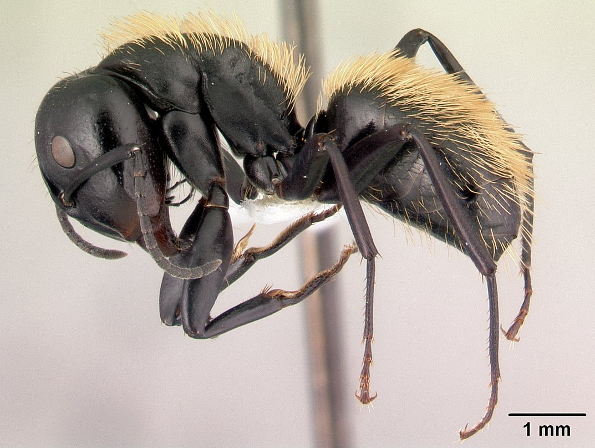

# Homework 1 for Tools for Computational Biology

## Description 

This file contains a guide to using the repository `tfcb-homework01` which can be found here [my repository](https://github.com/egomezr7/tfcb-homework01).

## Contents

This repository contains a `new-project-directory` master folder with three sub-folders:
- analysis
- data
- images

## Analysis

This folder contains python code for handling and analyzing the data and images within this repository.

## Data

This folder contains raw survey data in `Survey_Data.xlsx` and survey data in `spreadsheet` -style using tidy principles in `tidy_survey_data.xlsx` and `tidy_survey_data.tsv`.

## Images

This folder contains images related to the repository.

| Organism                 |  Image Link     |
|--------------------------|-----------------|
|*Acanthomyrmex ferox*| |
|*Camponotus darwinii*| |
|*Cataglyphis fortis*| |
|*Rhytidoponera metallica*| |

## Tables

Below is an example of a table. This table describes the insects found in the images in the images folder by the regions they are native to.

| Scientific Name         | Native Region      |
|-------------------------|--------------------|
|*Acanthomyrmex ferox*    | Southeast Asia     |
|*Camponotus darwinii*    | Madagascar         |
|*Cataglyphis fortis*     | Algeria and Tunisia|
|*Rhytidoponera metallica*| Australia          |